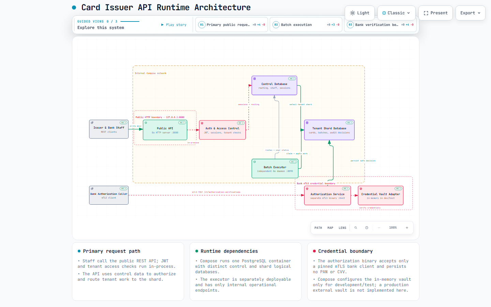

# Card Issuer API

Start the complete local proof-of-concept environment:

```bash
docker compose up --build
```

Use Docker Desktop with Linux containers on Windows or macOS, or Docker Engine with Compose v2 on Linux. Go and PostgreSQL run inside the images; neither is required on the host for this command. The initial image download/build requires internet access.

Compose includes a deliberately public base64-encoded 64-byte Ed25519 development key, so no JWT setup is required for local POC startup. **It must never be used in production.** Production deployments must inject a unique `AUTH_JWT_PRIVATE_KEY_B64` through their secret configuration. `AUTH_JWT_ISSUER` and `AUTH_JWT_AUDIENCE` default to `card-issuer-api` and should be set explicitly in production.

The API is available at [http://localhost:8080/health/live](http://localhost:8080/health/live). [Readiness](http://localhost:8080/health/ready) checks the authentication, routing, and shard database connections. The separate mTLS authorization service is published only to this machine at `https://localhost:8443`.

## What starts

| Service | Purpose |
| --- | --- |
| `postgres` | PostgreSQL 17.11 with a named persistent volume and two databases. |
| `db-init` | Runs portable shell-based schema migrations and test seeds, provisions restricted connection accounts, verifies their credentials, then exits successfully. |
| `app` | Go 1.27.1 API server running as non-root with separate control/shard pools. |
| `executor` | Independently deployable Go 1.27.1 batch/expiry daemon with internal-only operational endpoints. |
| `devvault` | Non-durable development-only credential vault on the internal network; it has no host port. |
| `pki-init` | Creates ignored local mTLS files in `.local/authorization-pki`, then exits successfully. |
| `authorization` | TLS 1.3 client-certificate credential-and-lifecycle verifier, published only at `127.0.0.1:8443`. |

Compose waits for healthy PostgreSQL and successful initialization before starting the app. `db-init` and `pki-init` showing **Exited (0)** are expected. PostgreSQL is published only to this host at `127.0.0.1:5432`; the API is published at `127.0.0.1:8080`.

Both databases remain distinct: `card_issuer_control` stores routing/authentication and `card_issuer_shard_01` stores bank data. Existing migrations, checksums and seeds are reused unchanged. Every new initialization run checks migration history and preserves existing accounts, passwords and data.

## Architecture

The runtime architecture below reflects the current local proof-of-concept: the public API, access control, separate control and tenant-shard databases, the independent executor, and the mTLS authorization boundary.

Select the preview to explore the interactive architecture diagram.

[](https://fermarro13.github.io/card-issuer-api/ "Open the interactive architecture diagram")

### Improvements out of scope

The following production-oriented improvements were intentionally out of scope for this work:

1. Add an API gateway.
2. Add a load balancer.
3. Define cloud deployment planning.

## Health endpoints

| Endpoint | Success | Failure |
| --- | --- | --- |
| `GET /health/live` | 200, `{"status":"ok"}` | Independent of database availability. |
| `GET /health/ready` | 200, `{"status":"ready"}` | 503, `{"status":"not_ready"}` if either database check fails or the shared two-second deadline expires. |

The application keeps running during a database outage and becomes ready again when both connections recover. Database details and credentials are excluded from HTTP responses. Each pool is limited to five connections. HTTP requests and graceful shutdown have bounded timeouts.

## API documentation

After the API starts, open the public interactive catalog at [http://localhost:8080/swagger/index.html](http://localhost:8080/swagger/index.html). It documents the health, authentication, and public `/v1` resource API. Use Swagger UI's **Authorize** control to supply a `Bearer <access token>` obtained from Login before trying protected operations; the catalog itself is intentionally public.

The Swagger files are generated during Docker and CI builds. Before running local Go checks after changing API annotations, generate them with:

```bash
go tool swag init -g main.go -d cmd/api,internal/server --parseInternal -o docs
```

Generated files are intentionally not committed. The network-isolated mTLS authorization-verification service and the internal executor remain outside this catalog; use the [Postman collection](postman/card-issuer-api.postman_collection.json) for the mTLS request.

## Postman

Import [postman/card-issuer-api.postman_collection.json](postman/card-issuer-api.postman_collection.json) into Postman. It includes every currently implemented health and authentication endpoint, collection variables, request-body examples, bearer-token capture, and refresh-cookie guidance.

For the `Authorization verification (mTLS)` request, keep `base_url` as `http://localhost:8080` and use `authorization_base_url` as `https://localhost:8443`. Configure Postman with `.local/authorization-pki/bank-client.pem` and `.local/authorization-pki/bank-client-key.pem`, and trust `.local/authorization-pki/server-ca.pem`. These files are generated for one local machine only, are ignored by Git, and must never be used in another environment. Issue and activate a card first, copy its one-time credentials only into the transient `authorization_pan` and `authorization_cvv` collection variables, send a new transaction reference, then clear both variables.

## Development credentials and overrides

The four application test accounts are documented in [database/TEST-CREDENTIALS.md](database/TEST-CREDENTIALS.md). Both bank users belong to Test Bank. These accounts are distinct from PostgreSQL connection accounts.

The following deliberately public database defaults support local POC startup:

| PostgreSQL account | Default password | Purpose |
| --- | --- | --- |
| `postgres` | `Dev-Postgres-Admin!2026` | PostgreSQL initialization and `db-init` only. |
| `ci_app_control` | `Dev-Control-Reader!2026` | `ci_routing_reader` membership; control directory reads. |
| `ci_app_auth` | `Dev-Auth-Runtime!2026` | `ci_auth_runtime` membership; staff authentication only. |
| `ci_app_shard` | `Dev-Shard-Runtime!2026` | `ci_business_runtime` membership; tenant-scoped shard access. |
| `ci_app_executor` | `Dev-Executor-Runtime!2026` | `ci_executor_runtime` membership; batch/expiry execution only. |

The app receives three separate runtime passwords. Runtime accounts have no ownership, role/database creation, superuser, replication or RLS bypass privileges.

Copy `.env.example` to `.env` only when you want to override the API port, database names, shard ID, technical passwords, executor tuning, or the POC JWT key. `.env` is ignored by Git and excluded from image builds. The default `EXECUTOR_ID` is `executor-dev-01` for a single local executor; set a unique value for every executor replica outside that simple setup. Set a unique `AUTH_JWT_PRIVATE_KEY_B64` from secret configuration in every production deployment; never use the committed POC key.

**Existing volumes retain passwords.** Changing `POSTGRES_PASSWORD` in `.env` does not change an initialized PostgreSQL administrator password. Runtime account provisioning also preserves existing technical passwords and verifies the supplied credentials; a mismatch fails initialization. To change a password while preserving data, use an authenticated administrator session and psql's `\password account_name`, then update `.env` to match. Application staff passwords are likewise never reset by seeds.

## Everyday commands

```bash
# Run in the background; inspect status and logs.
docker compose up --build -d
docker compose ps -a
docker compose logs -f app db-init

# Stop and remove containers, retaining database data.
docker compose down

# Rebuild/recreate the app after code changes.
docker compose up --build -d app
docker compose up --build -d executor
docker compose up --build -d authorization

# Open an administrative SQL session inside PostgreSQL.
docker compose exec postgres psql -U postgres -d card_issuer_control

# Explicitly rerun initialization against retained data.
docker compose run --rm db-init
```

New migration files require rebuilding `db-init` because SQL is copied into its image. For an orderly migration/rebuild cycle, run `docker compose down` followed by `docker compose up --build`. Dependencies gate **new startup**; they do not stop an already-running app if a separately executed initializer fails. Existing application processes are not automatically supervised by the initializer.

For a deliberately empty development database, `docker compose down --volumes` removes this project's persistent database volume and its contents. The next `docker compose up --build` initializes fresh databases and test users. Normal shutdown does not delete data.

## Verification

Run server unit tests with Go 1.27.1:

```bash
go version
go test -count=1 ./...
go vet ./...
```

Without `CI_TEST_DATABASE=1`, the runtime database integration test is explicitly skipped. To run it, set `PGHOST`, `PGPORT`, `PGUSER`, `PGPASSWORD`, and `PSQL` for an administrative connection to a disposable PostgreSQL 17 server using SCRAM/password authentication; set `CI_TEST_DATABASE=1`, then run `go test -count=1 -v ./...`. The test creates/removes only random `ci_env_*` databases. It uses fixed technical roles and intentionally tests their privilege guards, so use a dedicated test instance. It leaves its technical roles for reuse. The existing database suite is a separate Go module: follow [database/README.md](database/README.md#verify).

For actual container builds and lifecycle checks, run the smoke test for your host shell:

Windows with PowerShell 7:

```powershell
./scripts/Test-Compose.ps1
```

Linux or macOS with `/bin/sh` and `curl`:

```sh
sh ./scripts/Test-Compose.sh
```

Pass `--app-port 18080` to the shell script or `-AppPort 18080` to the PowerShell script to choose another isolated port. Both tests verify empty-volume startup, migration/user creation, non-root execution, retained passwords, PostgreSQL outage/recovery, and initialization-failure gating. Each removes only its randomly named Compose project and disposable volume afterward. They require a working Docker engine and Docker Compose v2; the shell version also requires `curl`.

On Windows, `HCS_E_HYPERV_NOT_INSTALLED` means Docker Desktop's WSL2 engine cannot start until Windows Virtual Machine Platform and firmware virtualization are available. On Linux, ensure the Docker daemon is running and the current user can access it. Container tests cannot run until Docker can start Linux containers; ordinary Go/PostgreSQL test evidence does not substitute for a successful image build.

See [database schema](database/SCHEMA.md), [database tooling](database/README.md), and [the design](docs/database-design.md) for data-model and application responsibilities.

## Functional API tests

The optional pytest container exercises the running Compose API and verifies persisted rows through the internal POC PostgreSQL service. It is intentionally limited to a disposable development stack because it uses the Compose PostgreSQL administrator account and leaves test data behind.

After starting a freshly initialized stack, run:

```powershell
docker compose --profile functional run --rm functional-tests
```

This run includes the unskipped issue → activate → mTLS authorization scenario. It uses the generated files mounted read-only and fails if the vault, PKI, or authorization service is unavailable. The full Compose smoke scripts additionally run a two-replica executor contention scenario and a concurrent idempotent batch-create test; the replica-specific pytest case is skipped when the `FUNCTIONAL_EXECUTOR_IDENTITIES` setting is absent.

The `functional` profile is not started by ordinary `docker compose up`.

[Open the interactive bank-operator happy-path sequence diagram](docs/diagrams/pytest-happy-path.sequence.html). It traces issuer setup, bank-operator provisioning, card issuance and lifecycle, plus the control and tenant-shard assertions made by the pytest scenario.

## Executor operations

The executor never exposes business routes or communicates with the API process. Its Compose port remains on the internal network. It serves `GET /health/live`, `GET /health/ready`, and Prometheus `GET /metrics`; readiness checks the control and shard pools. Its configuration is independent of API authentication: `EXECUTOR_ID`, `EXECUTOR_HTTP_ADDR`, control/shard database URLs, shard ID, polling/concurrency/lease values, batch retry/backoff/size limits, expiry backoff, and drain timeout are all required outside Compose's development wiring.
