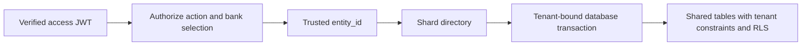
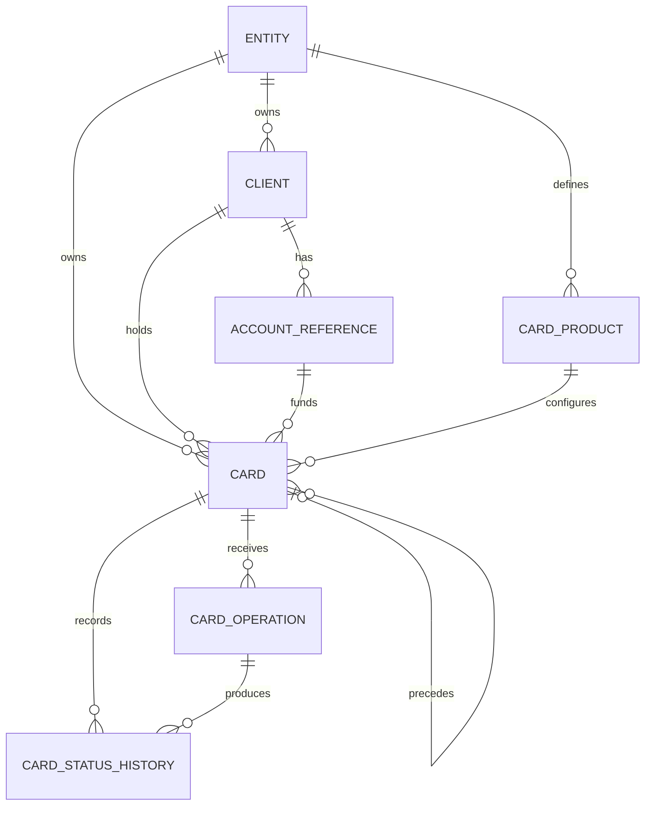
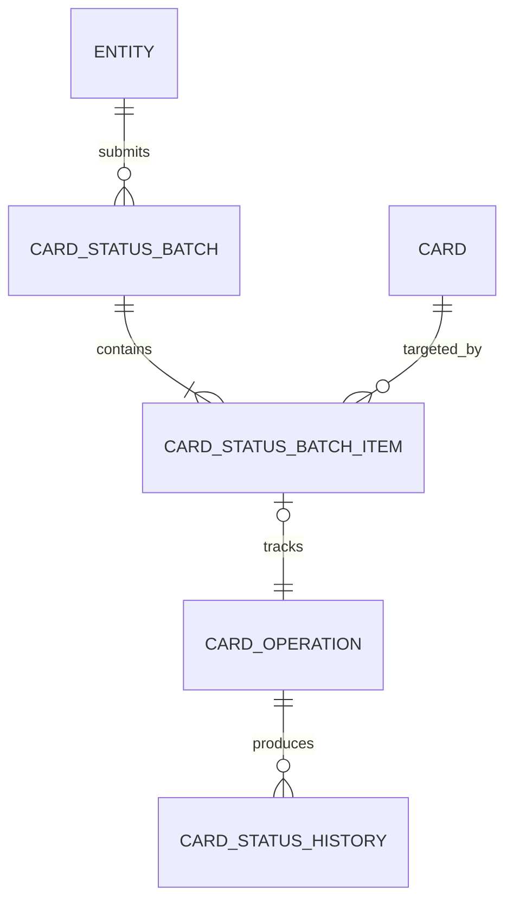
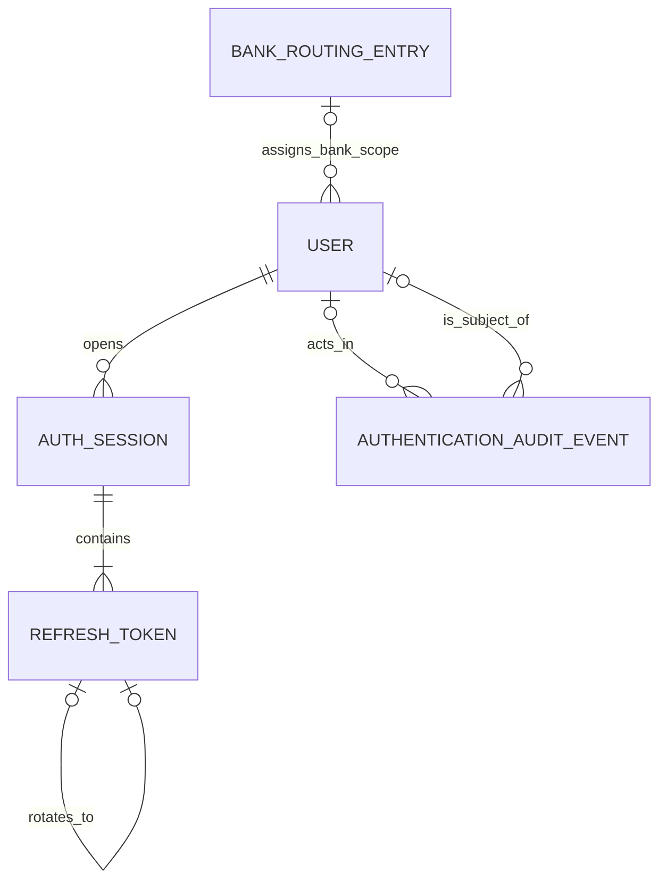

# Card Issuer API — Database Design

**Status:** Implemented design baseline. The initial schema and associated application features are delivered to the extent recorded in `docs/plans/INDEX.md`; this document is not a production-readiness or feature-gate approval.
**Date:** 2026-09-10  
**Related plans:** [Initial Database Design](plans/2026-09-10-database-design-document.md); [Authentication and Authorization Amendment](plans/2026-09-10-database-authentication-authorization.md)

## 1. Purpose and scope

Design a PostgreSQL database for a banking-as-a-service platform that owns the full virtual-card lifecycle, including issuance, activation, suspension, resumption, closure, expiry, and replacement.

The design must support independent bank-owned customer data, auditable changes, thousands of records per bank, and growth beyond a single database through `entity_id`-based routing.

Staff access uses local provisioned accounts, JWT access tokens, rotating refresh tokens, and four fixed issuer/bank operator/read-only roles. Authentication records live centrally and do not unify bank Client records.

It must also support **batch-processing logic for card status updates, with attention to atomicity and consistency**. Accepted batches execute asynchronously, request one common target status, and apply all card updates in one transaction or none at all.

Accounts remain bank-owned. This API stores references and relationships to those accounts; account balances, financial transactions, ledger processing, and physical-card fulfillment are outside the initial scope. This document introduces no executable schema, infrastructure, or application code.

## 2. Architecture and bank ownership

An **Entity** represents a bank and is the tenant boundary. All bank-owned child records carry `entity_id`. The same person at two banks has two independent Client records, with no shared profile, global customer identity, cross-bank matching, deduplication, or enrichment.

All banks initially use shared tables in one PostgreSQL data shard. A control-plane directory maps each authorized target bank to that shard from the beginning. The control database also stores staff authentication records. Adding another shard later changes placement rather than the bank-facing data model.

Shard routing selects a database. Tenant-scoped queries, constraints, and row-level security enforce bank ownership inside it. Sharding is not a substitute for authorization.

## 3. Domain model

The attributes below describe required information. Exact column types, lengths, status values, and executable DDL belong to implementation design unless a default is explicitly stated here.

| Entity | Responsibility | Principal information |
| --- | --- | --- |
| **Entity** | Bank identity and operational configuration. | ID, bank reference, name, operational status, timestamps. |
| **Client** | An individual customer belonging to one bank. | Entity ID, client ID, external customer reference, necessary customer information, timestamps. |
| **Account Reference** | Relationship to an account maintained by the bank. | Entity ID, reference ID, client ID, external account reference, timestamps. |
| **Card Product** | A bank-owned offering and issuance configuration. | Entity ID, product ID, product code, name, operational status, configuration. |
| **Card** | One locally issued card credential. | Entity ID, card ID, client ID, account-reference ID, product ID, current status, opaque credential reference, optional predecessor-card ID, lifecycle dates, version. |
| **Card Operation** | One logical lifecycle action and its execution outcome. | Entity ID, operation ID, card ID, action, execution status, reason, actor, correlation ID, timestamps, sanitized failure details. |
| **Card Status History** | A confirmed card-state transition. | Entity ID, history ID, card ID, operation ID, previous/new status, reason, actor, timestamp. |
| **Audit Event** | Bank-scoped business changes and rejected business operations. | Entity ID, event ID, actor ID and role/context snapshot, action, resource type/ID, outcome, correlation ID, timestamp, selected change details. |
| **Card Status Batch** | One request to transition a bank's selected cards to a common status. | Entity ID, batch ID, target status, requester, reason, submission identity, execution state, applied/ignored counts, linked retry source, lease/retry information, timestamps, failure summary. |
| **Card Status Batch Item** | One card and its operation within a batch. | Entity ID, item ID, batch ID, card ID, operation ID, confirmed previous status, applied/not-applied/ignored outcome, safe failure code. |
| **Card Expiry Run** | One system-owned daily expiration batch. | Entity ID, run ID, UTC run date, timestamps, aggregate counts. |
| **Card Expiry Run Item** | One independently processed card in an expiry run. | Entity ID, item ID, run ID, card ID, system `expire` operation ID, individual outcome, attempt count, safe failure code. |
| **Idempotency Record** | Deduplicate retried commands within one bank and operation scope. | Entity ID, record ID, operation scope, key, request fingerprint, processing state, result reference, expiry. |
| **Outbox Message** | Reliably dispatch work resulting from a committed transaction. | Entity ID, message ID, work type, operation or batch reference, minimal payload, processing state, attempts, next-attempt time, timestamps. |
| **User** | Central allowed staff login, separate from Client. | ID, unique normalized username, password hash, one role, bank assignment where required, status, auth version, timestamps and actors. |
| **Auth Session** | Central login session and refresh-token family. | ID, user ID, captured auth version, creation/absolute expiry/last refresh times, revocation time/reason. |
| **Refresh Token** | Central single-use refresh credential represented by a hash. | ID, session ID, unique token hash, optional parent token ID, issue/expiry/consumption times. |
| **Authentication Audit Event** | Central authentication and user-administration evidence. | ID, event type, outcome, optional actor/subject user IDs, optional bank context, session reference, request correlation, timestamp, sanitized details. |

The first fourteen entities reside on the bank's data shard. The four authentication entities reside in the control database and follow the central-key rules in Section 9 rather than the bank-child primary-key convention.

### 3.1. Relationships

Every bank-owned entity belongs to Entity, including where that edge is omitted for readability. Each account reference belongs to one client initially; a card must reference an account associated with its selected client and bank. Joint accounts and supplementary cardholders require an explicit extension.

### 3.2. Meaning of an account reference

An external account reference is an opaque identifier supplied by the bank for the account backing the card. A debit product may reference a checking or savings account; another product may reference a prepaid account or credit facility. It need not be a raw bank account number.

The bank remains authoritative for the account and its financial activity. This platform owns the association between client, account reference, and card. Account references are independent across banks even when their external values happen to match.

### 3.3. Card lifecycle and operations

A local issue or replacement command creates an `issued` card synchronously; the internal `pending` state is not exposed as a durable result of that command. **Card state and operation execution state are separate.** A failed activation operation leaves the last confirmed card state unchanged. Infrastructure retries reuse the same logical operation.

Replacement creates a new issued Card linked to its predecessor. The old card keeps its identity and history until activation of the successor closes it. Batch status updates use the same centrally validated lifecycle rules as individual card operations; replacement and issuance are not implicit status-only batch actions.

Issuance and replacement provision through the credential-vault boundary using the card UUID as correlation and idempotency identity. The database retains only the immutable masked PAN; a transient credential disclosure is returned only in the initial successful response, never from an idempotency replay. PAN, CVV, verification-code hashes, provider-like responses, and payment-data fingerprints must not appear in persistent storage, URLs, logs, audit payloads, examples, fixtures, or outbox messages. Development/test uses an explicitly restricted non-durable vault; production requires a separately provisioned PCI-compliant vault/HSM.

The lifecycle state machine and already-at-target behavior are implemented centrally and shared by API and executor work. No worker may invent or bypass those rules. Credential verification is limited to the separate mTLS authorization service; financial authorization and any remote-confirmation workflow remain out of scope.

## 4. Keys, integrity, and audit

### 4.1. Keys and tenant constraints

- Use opaque UUID identifiers. Entity has primary key `id`; initial bank-owned child tables use `(entity_id, id)` and reference their local Entity row.
- Include `entity_id` in all tenant-owned foreign keys and joins. Treat it as immutable ownership; relocating a bank to another shard does not change it.
- Make external client references, external account references, and product codes unique within their bank.
- Enforce card/client/account consistency with a composite account reference including `(entity_id, client_id, id)` and a corresponding unique key. Same-bank checks alone do not prevent linking the wrong client's account.
- Operation/history and batch-item/operation references must also agree on the card, not just the bank. Use supporting composite unique keys where needed to enforce these foreign keys.
- Preserve referenced records and lifecycle history; do not use cascading business deletion to erase audit evidence. Deletion and anonymization policies require a separate retention decision.

Resolve bank identity from authenticated server-side context. Require tenant-scoped repository methods and parameterized queries. Enable row-level security (RLS) and use a runtime role without ownership or bypass privileges. Set tenant context transaction-locally so pooled connections cannot retain another bank's context. Migration and operational roles remain separate from the runtime role.

Owners and privileged roles can bypass RLS, making role configuration part of the isolation design. [PostgreSQL row security](https://www.postgresql.org/docs/17/ddl-rowsecurity.html)

### 4.2. Transaction and audit rules

Mutable business records carry creation/update timestamps and actor references. Use UTC instants, represented by PostgreSQL `timestamptz`, for event and lifecycle timestamps.

Commit successful business changes, confirmed status history, successful-change audit events, and any applicable outbox messages together. Local issue/replacement commands also co-commit their issued card, succeeded operation, generated opaque reference, status history, audit evidence, and idempotency result. Ordinary reads use current Card state rather than reconstructing it from history. Audit and status-history records are append-only to the application.

Record selected changes and necessary context, not full copies of customer records. Failed and rejected actions require a path that survives rollback. Authentication and user-administration events use the restricted central Authentication Audit Event table, including events before trustworthy bank identification; a caller-supplied bank identifier does not establish tenant ownership.

Business actors and batch `requested_by` values reference immutable central User IDs logically, not through cross-database foreign keys. Retain minimal immutable role and authorized-bank snapshots at the action checkpoint; do not rewrite prior audit attribution when roles change. Distinguish the initiating user from a background worker's executor identity. Central authentication data is not copied into bank Client records.

Application append-only permissions do not make records tamper-proof against administrators. Retention, tamper-evidence, and archival controls remain explicit implementation decisions.

### 4.3. Database atomicity versus service effects

An outbox makes committed future integration work discoverable but does not make a remote service part of the PostgreSQL transaction or guarantee exactly-once delivery. Consumers must deduplicate and reconcile uncertain outcomes. V1 local issue/replacement creates no outbox work.

The atomic batch guarantee covers local card states and associated database records. A successful batch result reports that database outcome; it does not imply any future network effect. Track future delivery separately through the outbox and associated operation records.

If a transition's meaning requires remote confirmation before the card can assume that state, it must not run through the database-only batch path until the confirmation/orchestration contract is defined. Sequential remote calls cannot be made all-or-nothing by rolling back local SQL.

## 5. Asynchronous card-status batches

### 5.1. Membership and fields

Every accepted item has exactly one logical Card Operation; standalone operations need not belong to a batch. Each batch contains at least one item and requests one common target status. Accepted membership, target status, and reason are immutable. Changing them creates a new batch.

**Card Status Batch fields**

| Field | Purpose |
| --- | --- |
| `entity_id`, `id` | Bank ownership and batch identity. |
| `target_status`, `reason` | Shared requested transition and business justification. |
| `requested_by`, `request_id` | Authenticated actor and request correlation. |
| `idempotency_record_id` | Bank-scoped submission identity. |
| `status` | `queued`, `processing`, `succeeded`, or `failed`. |
| `item_count` | Number of cards in the accepted batch. |
| `attempt_count`, `next_attempt_at` | Retry count and scheduling time. |
| `lease_owner`, `lease_expires_at`, `lease_version` | Worker ownership, recovery deadline, and fencing generation. |
| `created_at`, `started_at`, `completed_at` | Submission and execution timestamps. |
| `failure_code`, `failure_summary` | Sanitized terminal failure information. |

**Card Status Batch Item fields**

| Field | Purpose |
| --- | --- |
| `entity_id`, `id`, `batch_id` | Ownership, item identity, and parent batch. |
| `card_id`, `operation_id` | Target card and associated logical operation. |
| `previous_status` | State immediately before a successful change; populated only on successful application. |
| `outcome` | `pending`, `applied`, `not_applied`, or `ignored`; only an applied item records `previous_status`. |
| `failure_code` | Optional safe item-specific failure explanation. |

The target status stays on the header; it is not duplicated on each item. A history record contains the actual previous/new states after a successful transition.

### 5.2. Constraints and final outcomes

- Use tenant-scoped foreign keys to the batch, card, and operation. All rows must belong to one bank and data shard.
- Unique `(entity_id, batch_id, card_id)` prevents duplicate cards within a batch.
- Unique `(entity_id, operation_id)` prevents reusing one operation for multiple items.
- Enforce that the associated operation targets the item's card, using a composite reference including card ID.
- Validate `item_count` against the immutable accepted membership during submission and processing. Cross-row counts are not ordinary row-level check constraints.
- A successful batch has every item `applied` or `ignored`, and header applied/ignored counts must equal the item outcomes. A terminal failed batch has only `not_applied` or already identified `ignored` items, zero applied count, and zero committed card updates from that batch. Partial success is unsupported.
- Update item outcomes, related operation outcomes, and the batch result consistently within the applicable success or failure transaction.

### 5.3. Submission and execution

1. **Validate admission.** Validate the access JWT, authorize its role for the requested action and target bank, and establish tenant context. Validate target status, nonempty membership, and the configured size limit. Reject duplicate cards and identifiers that are not accessible within the bank. Do not disclose whether an inaccessible card exists elsewhere.
2. **Persist acceptance.** In one transaction, create the immutable `draft` batch, its pending items and queued operations, submission audit, and idempotency record. Return the batch ID only after acceptance commits. Invalid admission does not create a partly populated batch; record the rejected request through the appropriate audit path. The separate execute command validates the exact persisted membership and changes the draft to `queued`.
3. **Claim work.** A worker atomically claims eligible queued work with a bounded lease and fencing generation. Duplicate claim attempts do not grant concurrent ownership. Schedule banks fairly.
4. **Authorize, lock, and revalidate.** Before each execution attempt, read the submitter's current enabled state, role, and bank assignment from central authentication as described in Section 9.6. Fail unauthorized work without card changes; defer if that check is unavailable. After a successful check, start the shard execution transaction, lock the batch, verify worker ownership and bank eligibility, then lock affected cards in deterministic ID order. Validate transitions against current card states. Submission-time checks do not justify a stale transition.
5. **Commit success.** Apply every card update, version change, operation outcome, item outcome, status-history entry, successful-change audit, and the batch's `succeeded` result in this same transaction.
6. **Handle failure.** Roll back all card effects when any item cannot transition. For a terminal failure, use a subsequent guarded transaction to mark the batch `failed`, its items `not_applied`, its operations unsuccessful, and append failure audit evidence. Diagnostic failures on one item must not imply that other items applied.

Submission and failure records may remain committed even though no card update committed. That is deliberate auditability, not partial application of the batch.

### 5.4. Concurrency, retries, and recovery

Overlapping batches serialize through card locks and revalidate the states they encounter. Apply the same concurrency discipline to individual card updates. Never hold a card-update transaction open while making remote service calls.

Retry transient infrastructure failures with bounded backoff and the same logical batch/operations. During retry, items remain pending. Terminal validation failures do not retry automatically; retry exhaustion becomes a recorded terminal failure. Exact backoff and lease values require implementation benchmarks.

A recovery worker may reclaim expired work only through a guarded ownership change. Execution holds the batch row lock through finalization; reclaimers must respect that lock. Every attempt verifies its lease generation before modifying cards, so a stale claimant cannot execute after ownership was reassigned. An expired timestamp alone does not permit ignoring an in-flight transaction's locks.

If the connection drops during commit, inspect the persisted result before retrying or recording failure. A committed `succeeded` batch is terminal. If failure recording itself is interrupted, recovery must resolve the prior outcome before finalizing it.

Idempotency is bank- and operation-scoped. Repeating a key with the same normalized target status, membership, and relevant request fields returns the existing batch; a different request conflicts. Canonicalize membership for fingerprinting so merely reordering the same card IDs does not change its meaning. Active work must not lose its idempotency record to cleanup.

### 5.5. Daily expiry runs

Public card-status batches remain atomic. Daily expiry is a separate system-owned run that starts at `00:00` UTC and creates one item for each due eligible card. Each item transitions its card in an independent transaction, so an expiry run may have a mix of `expired`, `skipped_already_expired`, and `manual_retry_required` item outcomes.

An item gets one initial attempt and up to three automatic retries. Before every retry, the worker locks and rereads the card: it retries only a card that is still not expired; otherwise it records `skipped_already_expired` and stops. After the third retry fails, the item's transaction is rolled back and its result becomes `manual_retry_required` with a sanitized failure code. Only an `issuer_operator` may queue that individual item again through the normal idempotent, audited manual-retry API command, and selection rejects a card that has already expired. A manual failure returns it to `manual_retry_required` without restarting automatic retries. The scheduler never retries that item automatically again.

### 5.6. Size and shard boundaries

Use a configurable maximum item count, selected by load testing. Do not silently divide one accepted atomic batch into separately committed chunks. Larger workflows may submit multiple explicitly independent batches, each with its own result.

Batch headers, items, operations, bank-scoped audits, business idempotency, and the available future-integration outbox reside with their bank's cards. Staff users, authentication sessions/tokens, and authentication audits remain central. Bank relocation pauses batch workers and drains in-flight transactions before cutover.

## 6. Indexes and access patterns

Bank-scoped B-tree indexes begin with `entity_id`, followed by relevant equality filters and ordering columns. This aligns them with tenant-scoped queries. [PostgreSQL multicolumn indexes](https://www.postgresql.org/docs/current/indexes-multicolumn.html)

| Access pattern | Initial index |
| --- | --- |
| Resolve client reference | Clients: unique `(entity_id, external_client_ref)` |
| List clients | Clients: `(entity_id, created_at DESC, id DESC)` |
| Resolve account reference | Account references: unique `(entity_id, external_account_ref)` |
| List client accounts | Account references: `(entity_id, client_id, id)`; also supports the required relationship key |
| Resolve product code | Products: unique `(entity_id, product_code)` |
| List bank cards | Cards: `(entity_id, created_at DESC, id DESC)` |
| List client cards | Cards: `(entity_id, client_id, created_at DESC, id DESC)` |
| Filter cards by status | Cards: `(entity_id, status, created_at DESC, id DESC)` |
| Find account/product cards | Cards: separate `(entity_id, account_reference_id)` and `(entity_id, product_id)` |
| Read card operations/history | Each table: `(entity_id, card_id, created_at DESC, id DESC)` |
| Browse bank audits | Audit events: `(entity_id, occurred_at DESC, id DESC)` |
| Audit one resource | Audit events: `(entity_id, resource_type, resource_id, occurred_at DESC, id DESC)` |
| Deduplicate commands | Idempotency: unique `(entity_id, operation_scope, idempotency_key)` |
| List bank batches | Batches: `(entity_id, created_at DESC, id DESC)` |
| List batches by processing state | Batches: `(entity_id, status, created_at DESC, id DESC)` |
| Select eligible queued batches | Partial `(entity_id, next_attempt_at, id)` for `queued` batches |
| Recover expired batch leases | Partial `(entity_id, lease_expires_at, id)` for `processing` batches |
| Retrieve batch items | Reuse unique `(entity_id, batch_id, card_id)` |
| Find batches affecting a card | Batch items: `(entity_id, card_id, batch_id)` |

If a future integration enables outbox workers, use a partial index over unfinished work ordered by bank, eligibility time, and message ID. Tenant-first worker indexes assume that the scheduler chooses a bank before selecting its work. A future global scheduler would need an independently reviewed access and authorization design.

The table lists access indexes, not every helper index required by foreign keys. Reuse indexes created by primary/unique constraints, including the batch item operation uniqueness and account relationship key; do not create identical nonunique copies. Add cleanup or JSON indexes only for demonstrated workloads. Every index adds storage and write maintenance. [PostgreSQL unique indexes](https://www.postgresql.org/docs/current/indexes-unique.html)

### Query conventions

- Use cursor pagination ordered by immutable creation time and ID. Default to 50 records and cap pages at 200, including batch-item listing.
- Bind cursors to the bank, filters, and ordering; authorize each request independently. Cursors are not authorization tokens and do not promise a multi-page transaction snapshot.
- Avoid deep offset pagination and mandatory exact totals. PostgreSQL still computes skipped rows for offsets. [PostgreSQL pagination](https://www.postgresql.org/docs/current/queries-limit.html)
- Select necessary columns and avoid per-record follow-up queries. Keep common filters in typed columns; reserve JSONB for bounded optional metadata.
- Include explicit tenant predicates even when RLS is enabled. Validate plans under the actual runtime role and realistic tenant sizes.

## 7. Entity-based shard routing

### 7.1. Control directory and initial deployment

Maintain a small control-plane directory with `entity_id`, assigned `shard_id`, `routing_version`, and `placement_status`. Keep shard endpoints and credentials in server configuration and secret storage, not bank-facing records.

Initially, the directory and authentication tables use a separate control database on the same PostgreSQL instance as the single data shard. The directory stores routing metadata, not customer profiles. Central users, sessions, refresh tokens, and authentication audits remain there when banks relocate. Bank-specific User assignments reference the local directory's unique `entity_id`. Each bank's authoritative Entity row and business relationships live on its assigned data shard; there are no cross-database foreign keys from shard records to the directory or central users. Provisioning must make placement routable only after local bank setup succeeds.

Use an explicit mapping rather than a direct hash modulo the current shard count. New shards can receive selected banks without remapping everyone. A large bank can receive a dedicated shard.

### 7.2. Routing and connections

- Resolve the trusted bank before beginning a business transaction. Pin each request/transaction to that placement.
- For bank roles, use the verified JWT bank assignment and reject conflicting request selectors. For issuer roles, authorize explicit bank selection using verified role claims and validate the directory entry before establishing tenant context. Never treat a raw selector as authoritative or pass a wildcard tenant to repositories.
- Use the same resolver for batch workers and any future outbox consumers. Neither request bodies nor message payloads may override authorized routing.
- Fail closed for missing/unavailable placement; never search another shard or silently fall back to a default.
- Bound connection pools per active shard and impose an overall connection budget per application instance, including headroom for workers and operations.
- Keep shard identity out of public IDs, URLs, and business contracts. Retain tenant-scoped queries, RLS, and constraints on every shard.
- Keep lifecycle decisions and immediate post-write reads on the primary. Future reporting replicas may serve only reads that tolerate lag.

### 7.3. Expansion and bank relocation

Introduce additional data shards when a tuned primary cannot meet measured requirements or a bank needs dedicated capacity. Apply the same versioned schema migrations to every shard with rollout tracking.

A future relocation feature must pause the bank's writes and workers, drain in-flight transactions, copy and validate its complete dataset, fence source access, update placement, invalidate stale routing, and resume on the destination. Stale requests must fail rather than read or mutate a retired copy. Establish a controlled read pause during cutover unless a separately validated read-routing protocol is provided.

Validate counts and relationships, including operations, batches, audits, idempotency, and any future pending outbox work. Reconcile in-flight remote effects before resuming only when an integration exists. Rollback must preserve a single writable location and must account for any writes already accepted at the destination. Relocation tooling and recovery rehearsal are separate implementation work.

This strategy scales across banks. One bank must still fit within its assigned shard; splitting an individual bank across shards is outside the design.

## 8. Capacity, partitioning, and operations

Thousands of records per bank do not alone justify multiple shards. Combined traffic, row size, working-set size, contention, history growth, and maintenance cost determine capacity.

Start with short transactions, query timeouts, bounded pools, and per-bank request/worker concurrency limits. Monitor throughput, p95/p99 latency, errors, lock/pool waits, CPU, I/O, table/index growth, queued-batch age/retries, and any future outbox backlog. A busy bank must not indefinitely starve others.

Use `pg_stat_statements` to find expensive query patterns and maintain autovacuum and planner statistics, especially for frequently updated cards, batches, and operations; include outbox records only when a future integration uses them. Tune queries and primary capacity before adding distributed storage. [Query statistics](https://www.postgresql.org/docs/current/pgstatstatements.html), [database maintenance](https://www.postgresql.org/docs/current/routine-vacuuming.html)

### Partitioning

Partitioning divides a logical table within a shard; it does not distribute writes across independent database servers. Start with unpartitioned tables.

The first candidates are audit/history tables, using monthly time partitions when measured growth makes maintenance or time-bounded queries problematic. Conversion requires an explicit migration, time predicates for pruning, automated creation of upcoming partitions, and reference review. PostgreSQL partitioned primary/unique constraints must include the partition key, so the initial `(entity_id, id)` keys cannot simply be retained as parent-table uniqueness for time partitioning. [PostgreSQL partitioning](https://www.postgresql.org/docs/current/ddl-partitioning.html)

Do not create one partition per bank initially. Do not detach/delete shared monthly data unless every affected bank's approved retention and hold requirements permit it. Archival storage and retrieval must preserve bank isolation. Establish backup, restore, and archive-validation procedures before removal.

## 9. Authentication and authorization

### 9.1. Fixed roles and allowed users

Each staff user has exactly one constrained role. Role scope determines which banks can be selected; permissions determine which operations are allowed. There are no configurable role, permission, or membership tables.

| Role | Bank scope | Permissions |
| --- | --- | --- |
| `issuer_operator` | All banks | Full supported bank/product/client/account-reference administration, card issuance/replacement/lifecycle operations, batches, and user administration. |
| `bank_operator` | One assigned bank | Read business data; create products, clients, account references, cards, and replacements; and request all supported card-status changes, including permanent closure, individually or in batches. |
| `bank_readonly` | One assigned bank | Read business data and permitted business audit/history records. |
| `issuer_readonly` | All banks | The same business read permissions across banks. |

Bank operators cannot delete records, administer users, modify banks, or patch products, clients, and account references. Issuer operators remain subject to lifecycle validation, atomicity, credential handling, and retention constraints; full administration does not authorize editing audit history. Application roles never grant PostgreSQL superuser or RLS-bypass privileges.

Business read permissions exclude password hashes, token records, credentials, and unrestricted authentication logs. Issuer operators administer users and may review sanitized authentication/user-administration evidence through explicitly authorized operations; they do not retrieve credential material. All roles can perform their own login, refresh, logout, and password-change actions without gaining business write permissions.

Only issuer operators provision users or change their roles/bank assignments. Bootstrap the first issuer operator through a controlled operational process. There is no public self-registration. Disable audited users rather than deleting their identity. Staff Users and bank Clients are unrelated identity domains; a central staff login must not become a shared customer profile.

### 9.2. Central tables, relationships, and constraints

`BANK_ROUTING_ENTRY` represents the existing central shard directory, not another copy of the bank's business Entity. A bank-specific user has one assignment; an issuer user has none. Successful login creates a session with an initial refresh token. Every subsequent token has one predecessor and each token can have at most one successor, within the same session.

| Table | Fields and constraints |
| --- | --- |
| **User** | UUID `id`; unique `normalized_username`; `password_hash`; constrained `role`; nullable `entity_id`; enabled/disabled `status`; monotonically increasing `auth_version`; `created_at`, `updated_at`, `created_by`, `updated_by`. Actor references may be absent for controlled bootstrap. |
| **Auth Session** | UUID `id`; `user_id` foreign key; captured `auth_version`; `created_at`, absolute `expires_at`, `last_refreshed_at`; nullable `revoked_at`, `revocation_reason`. |
| **Refresh Token** | UUID `id`; `session_id` foreign key; unique `token_hash`; optional `parent_token_id`; `issued_at`, `expires_at`, nullable `consumed_at`. |
| **Authentication Audit Event** | UUID `id`; `event_type`, `outcome`; optional `actor_user_id`, `subject_user_id`, trusted `entity_id` context, and `session_id`; `request_id`, `occurred_at`, sanitized details. Unknown users or banks need not have references. |

- Central tables use UUID primary keys and local foreign keys; they do not universally require `entity_id` or bank-child composite primary keys.
- Use a platform-wide normalized staff username namespace. This uniqueness is unrelated to Client external-reference uniqueness within each bank.
- Require non-null `entity_id` for `bank_operator` and `bank_readonly`; require null for `issuer_operator` and `issuer_readonly`. Assigned banks reference the directory locally. Audit bank context is independently validated and may be absent for platform actions or failed authentication.
- Enforce unique token hashes and unique non-null `parent_token_id`. A supporting unique `(session_id, id)` key permits a same-session composite parent foreign key. Parentage is immutable; rotation creates a new token instead of relinking existing rows.
- The session is the refresh-token family. Its expiry/revocation applies to every token in it; token expiry must not exceed the session's absolute expiry.
- Retain consumed tokens throughout family validity for replay detection. Cleanup is bounded and retention-aware; it must not cascade-delete authentication audits. Local references from retained audits constrain deletion of referenced users/sessions until their retention requirements are satisfied.
- Restrict central authentication-table access to authentication/user-administration components. Bank business repository roles do not gain raw access merely because their users authenticate centrally.

Store only password hashes, with Argon2id as the default; never plaintext or reversibly encrypted passwords. Keep parameters encoded with each hash and select work factors during implementation. [OWASP password storage](https://cheatsheetseries.owasp.org/cheatsheets/Password_Storage_Cheat_Sheet.html)

### 9.3. Authentication indexes

| Access pattern | Index |
| --- | --- |
| Resolve staff login | User: unique `(normalized_username)` |
| List/filter bank staff | User: `(entity_id, role, status)` |
| List user sessions | Auth Session: `(user_id, created_at)` |
| Expire/clean sessions | Auth Session: `(expires_at, id)` |
| Resolve submitted refresh token | Refresh Token: unique `(token_hash)` |
| Retrieve a session's token history | Refresh Token: `(session_id, issued_at)` |
| Prevent branched rotation | Refresh Token: unique non-null `(parent_token_id)` |
| Enforce same-session parent reference | Refresh Token: unique `(session_id, id)` |
| Select token cleanup candidates | Refresh Token: `(expires_at, id)`; also check family validity and retained references |
| Browse authentication events | Authentication Audit Event: `(occurred_at DESC, id DESC)` |
| Inspect subject events | Authentication Audit Event: `(subject_user_id, occurred_at DESC, id DESC)` |

Reuse indexes created by constraints. Central global queries do not automatically use an `entity_id`-first index; this differs intentionally from bank business-table access. Further actor/session audit indexes depend on demonstrated access patterns.

### 9.4. Login, JWTs, and refresh rotation

**Implemented defaults:** access JWTs last 15 minutes; session/refresh-family validity ends seven days after login with no sliding extension. Multiple concurrent sessions are allowed. Each refresh credential is a cryptographically random opaque value stored only as a hash.

Login validates the provisioned user's password and current enabled state, then atomically creates the session with the current `auth_version`, its initial refresh-token hash, and successful-login audit evidence. Do not return credentials before commit. Credential/session mutations and their successful authentication audits share a control-database transaction; rejected attempts are recorded without rolling back required failure/revocation evidence.

Access JWTs include `sub` (User ID), `role`, bank assignment for bank roles, `sid` (session ID), `iss`, `aud`, `iat`, `exp`, and `jti`. Issuer roles have no fixed bank assignment. Validate signature, approved algorithms, issuer, audience, expiry, and role/bank claim consistency before trusting them. Do not include customer personal information or secrets. Signing keys remain in protected key configuration, outside business tables. [JWT best practices](https://www.rfc-editor.org/rfc/rfc8725.html)

On refresh, atomically verify the current enabled User, matching User/session `auth_version`, unexpired/unrevoked session, and submitted token's validity. Serialize against user authorization/password changes and session logout using a consistent User-then-session lock order. Consume the old token and create exactly one successor plus refresh audit evidence in the same transaction. Issue tokens using current authorized claims only after commit; rotation never extends the family's original expiry.

Reuse of a consumed refresh token revokes its session and requires login again. Commit that revocation and its audit before returning an authentication failure; do not undo replay protection by rolling back the error path. Concurrent refresh callers must coordinate: after one succeeds, replay by the other triggers the same family-revocation rule. If a committed refresh response is lost, replay may likewise require a fresh login; no replay grace window is assumed. [Refresh-token rotation](https://www.rfc-editor.org/rfc/rfc9700.html)

### 9.5. Expiry-based access-token revocation

Ordinary business requests validate JWTs without querying current User/session authorization state. `sid` and `jti` provide attribution; they do not imply a per-request session or denylist lookup. Normal bank routing, bank eligibility, RLS, and business validation still apply.

- Logout immediately marks the session revoked for future refresh attempts.
- Disabling a user, changing role/bank assignment, or changing/resetting their password atomically increments User `auth_version`. Existing sessions no longer match and cannot refresh, even if the user is subsequently re-enabled. Serialize these changes with refresh validation.
- Already issued access JWTs retain their signed role/bank permissions until `exp`, including after logout, password change, downgrade, reassignment, disablement, or refresh-family revocation.
- This means a disabled or downgraded issuer operator may still use the former signed permissions for the remaining access-token lifetime. Immediate access revocation is not promised by this design.
- No access-token persistence table or denylist is required. Do not describe incrementing `auth_version` as invalidating JWTs already issued: ordinary business requests do not look it up.

The accepted stale-permission window is bounded by the remaining 15-minute access-token lifetime. Refresh validation always uses current central state; failing that check never issues another token. Revoking one session leaves other sessions intact unless a User `auth_version` change invalidates them all.

### 9.6. Bank selection, audit attribution, and batch authorization

Bank roles derive their tenant from verified token claims; reject conflicting requested bank identifiers. Issuer roles may explicitly select a bank after token validation. Verify the role permits the action, resolve a valid bank directory entry, and establish trusted tenant context before routing. Every business transaction remains scoped to one bank/shard; issuer scope does not grant an unrestricted database role or permit cross-bank Client merging. Platform user administration operates centrally without inventing a bank tenant for issuer accounts.

Store immutable actor IDs and minimal role/bank snapshots in business audit records, including a batch's acceptance identity. Shard references to central users are logical, not database foreign keys. Centrally audit login/refresh/logout, failed authentication, replay detection, user provisioning, disablement, assignment/role changes, and password-change events. Never include raw tokens, password hashes, plaintext passwords, or full credential material in audits.

**Queued batches are an explicit exception to stateless request authorization.** After claiming work and before each shard execution transaction, read the submitter's current enabled state, role, and bank assignment from central authentication. Authorize the batch's action against its immutable bank. Do not use the submitted JWT's old permissions or reuse a previous attempt's authorization result.

- If current permission is absent, mark the batch failed with zero card changes through the existing guarded failure path.
- If central authorization cannot be checked, defer execution without changing cards or treating the user as authorized. This outage alone is not evidence of denied permission; keep the batch retryable rather than exhausting the business-operation retry budget solely on unavailable authorization.
- Ordinary logout, expired access JWTs, or password changes alone do not cancel accepted work. Execution checks current enabled state and role/bank authorization, not whether the original login session remains usable.
- Changes committed before the current authorization check are observed. Changes after that checkpoint do not retroactively cancel the attempt already authorized to execute. Central authorization and shard writes are not one atomic transaction, and a retry requires a fresh check.
- Record the execution authorization checkpoint and minimal decision context alongside the batch's shard audit. Perform the central check before acquiring card-update locks; no remote lookup should hold that business transaction open.

Do not trust a work message to override the submitter ID, batch bank, or current permissions. Authenticate workers operationally; human user roles do not define a new machine-to-machine credential scheme.

## 10. Validation scenarios

These scenarios remain the validation baseline. The implemented database, authentication, public-resource, batch-executor, and local-authorization work has passing automated and Compose evidence where recorded in `DEVELOPMENT_LOG.md`; any remaining feature-specific review gates are listed in `docs/plans/INDEX.md`.

Use a provisional benchmark of **100 banks × 10,000 cards**, corresponding clients/accounts, and approximately ten history/audit entries per card. Include a substantially larger and busier bank. These are test inputs, not production capacity guarantees. Record hardware, data distribution, concurrency, request mix, throughput, latency, and resource use.

### Isolation and relationships

- Identical external references can exist at different banks; unauthorized cross-bank reads, writes, joins, cursors, and guessed IDs fail without revealing existence.
- Wrong-client account references within the same bank fail.
- RLS remains effective under pooled-connection reuse and actual runtime roles; missing tenant context fails closed.
- Two-shard fixtures route correctly, reject missing placement, and never fall back to another shard.

### Authentication and authorization

- Exercise every role/action/bank combination: bank operators can request permanent closure but cannot issue/replace cards, delete records, or administer users; both read-only roles reject business mutations while retaining their own authentication actions.
- Validate issuer selection of different banks, bank-role attempts to override assignment, malformed role/bank claims, and continued shard/RLS isolation for global roles.
- Reject duplicate normalized usernames, missing assignments for bank roles, assignments for issuer roles, cross-session token parents, branched rotation, and duplicate token hashes.
- Reject invalid JWT signatures/algorithms, issuer/audience mismatches, and expired tokens. Confirm that live signed JWTs retain their old permissions after logout, disablement, downgrade/reassignment, password change, and refresh-family revocation until expiry.
- Reject login for disabled users and refresh for disabled users, revoked/expired sessions, version mismatches, or consumed tokens. Re-enabling a user does not revive old versioned sessions.
- Exercise rotation, concurrent refreshes, response loss, replay, absolute family expiry, multiple sessions, and races with logout/role/password changes; verify committed revocation audit evidence.
- Validate logical business actor references and central foreign keys; user changes and retention cleanup must preserve historical attribution without credential disclosure or audit cascades.

### Lifecycle and batches

- Issuance retries do not duplicate logical operations/cards; replacement preserves predecessor history.
- Empty, oversized, duplicate-card, and cross-bank submissions fail admission without partial membership.
- One invalid transition produces zero card updates; successful batches produce consistent card, operation, item, history, audit, and header results.
- Same-key/same-request submission returns the original batch; changed target or membership conflicts.
- Concurrent overlapping batches and individual updates preserve centrally defined transitions.
- Worker interruption before commit leaves no partial changes; failure-audit interruption is recoverable.
- Duplicate claim attempts, expired leases, stale workers, and retry exhaustion cannot apply a batch twice or overwrite a terminal outcome.
- A lost commit acknowledgment cannot turn a committed success into failure.
- Local issue/replacement is a successful database result only after all card, operation, history, audit, idempotency, and opaque-reference records commit; no external-service outcome exists in v1.
- The `00:00` UTC expiry run can partially complete: every card outcome is independently recorded, each failed item gets only three automatic retries after its initial attempt, and automatic retry skips a card already expired by another action. Exhausted items require an audited manual retry.
- Permission loss before execution fails the batch without card changes even when its original JWT has not expired. Ordinary logout/token expiry or password change alone does not cancel authorized accepted work.
- Authentication-service unavailability defers work without using stale authorization. Retry after recovery rechecks current permissions; changes after the documented checkpoint do not imply distributed rollback.

### Performance and recovery

- Inspect `EXPLAIN (ANALYZE, BUFFERS)` for selective queries and deep cursor pages under the runtime role and realistic tenant distributions.
- Test several batch sizes, including the configured maximum, and measure lock duration, throughput, latency, and impact on other banks.
- Verify fair scheduling and pool limits under a dominant bank's workload.
- Rehearse future partition/shard changes, stale routing rejection, restore, pending-work recovery, and tenant isolation before cutover.

## 11. Unresolved implementation decisions

The documentation establishes domain boundaries and scaling strategies. Resolve the following before implementing the affected behavior:

- Exact card lifecycle states, valid transitions, and already-at-target semantics. Delayed-execution authorization follows the settled checkpoint rules in Section 9.6.
- Future credential-provider contracts, remote-confirmation requirements, and reconciliation semantics. V1 local issuance/replacement has no remote completion.
- Final columns, lengths, checks, nullability, helper keys, operation-state vocabulary, and field-level API contracts.
- Client data minimization, product configuration/versioning, and account-reference lifecycle rules.
- Maximum atomic batch size, transaction timeouts, worker lease duration, retry/backoff limits, and fairness settings, based on measured workloads.
- Retention/anonymization policies, idempotency replay windows, completed-work cleanup, legal holds, and audit tamper-evidence controls.
- Production traffic and latency/availability objectives, PostgreSQL version, hosting capacity, backup/recovery objectives, and migration tooling.
- Shard provisioning, routing availability/caching policy, relocation fencing, and operational recovery procedures before multiple production shards are introduced.
- Signing-key algorithms/rotation/distribution, JWT verifier configuration, username normalization details, and password work factors. These do not change the approved role scopes or expiry-based revocation policy.
- Client-side token transport/storage, account recovery/bootstrap credential delivery, MFA, and machine-to-machine authentication. No flows or additional tables for these deferred capabilities are implemented here.
- Authentication audit/session/token retention, bounded cleanup scheduling, and protection/availability of the central authentication database, while retaining consumed tokens through family validity and preserving audit references.

**Established defaults:** independent clients per bank; bank-owned external accounts; virtual cards first; shared PostgreSQL tables; `entity_id` routing to one initial data shard; asynchronous operator-created status batches with one target status and all-or-nothing local card updates; a non-atomic system expiry run every day at `00:00` UTC with per-card results and up to three automatic retries; four fixed staff roles; central local authentication; 15-minute access JWTs; seven-day non-sliding refresh families; expiry-based access revocation; current-user authorization before every batch execution attempt.
